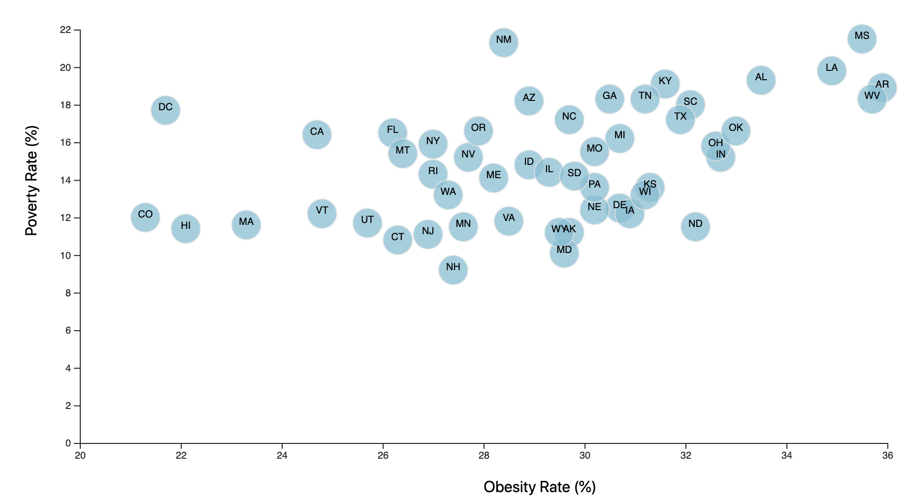

# D3 Homework - Data Journalism and D3

## Background

This graph is the start of a series of stories with data visualizations that analyze the current health trends shaping people's lives, this series will feature charts, graphs, and interactive elements to help readers understand our findings.

This first part shows a glimps of data from the U.S. Census Bureau and the Behavioral Risk Factor Surveillance System.

The data set is based on 2014 ACS 1-year estimates from the [US Census Bureau](https://data.census.gov/cedsci/).

## Health Risks Facing Particular Demographics

### Obesity Rate vs Poverty Rate for each U.S. State

[Click here to view the interactive scatter chart and read the initial findings of this comparison.](https://lrios215.github.io/D3-Challenge/D3_data_journalism/) 

1. This page utilizes html, javascript, and css to create the page.

2. D3 library was used to create the scatter plot with each state being represented by circle elemetns. 

3. Each circle element, when clicked, will show the state appreviation, poverty and obesity rates.

4. Initial findings comparing obesity and poverty rates of U.S. States: 
    * Appears to be a low correlation between obesity and poverty rates
    * Some trends with states in the southeast that are higher in both poverty and obesity rates, such as AR, WV, MS, LS, and AL.
    * No particular trend regarding location of states with low obesity and poverty rates, such as: MA, HI, CO, and DC
    * Two states stand out: NM has a high poverty rate but mid-level obesity rate and NH has a low poverty rate and mid-level obesity rate. 

5. View the scatter plot (link above) to see all the states and read the initial findings.  As we continue to analyze the dataset, we'll make sure to report future findings!

